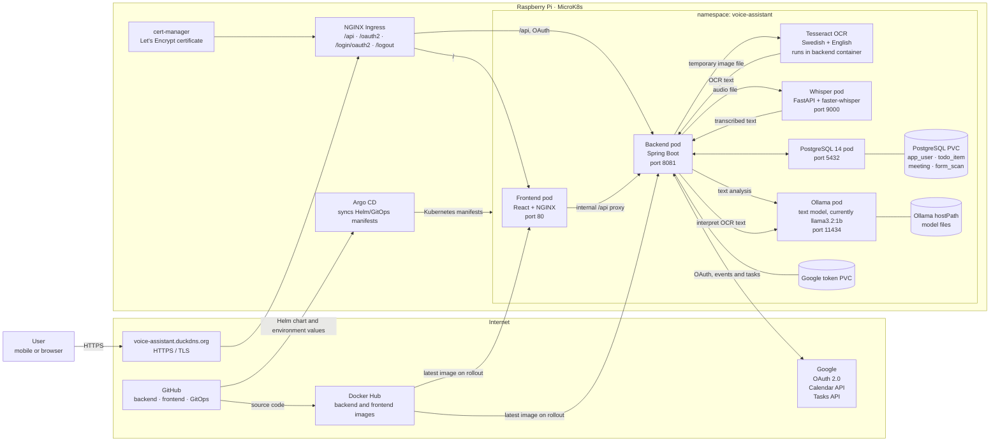

# Voice Assistant architecture

This document describes the current production architecture on the Raspberry Pi.
It covers the deployed runtime, the three user flows, persistent data, external
integrations, and the delivery path.



## User flows

### Voice command

```text
Browser recording → frontend → backend → Whisper → Ollama → review
→ user approval → PostgreSQL and, when connected, Google Tasks or Calendar
```

### Pasted text

```text
Frontend → backend → Ollama → review
→ user approval → PostgreSQL and, when connected, Google Tasks or Calendar
```

### Paper form scan

```text
Mobile camera → frontend → backend → temporary image → Tesseract
→ OCR text → Ollama → review
→ user approval → PostgreSQL and, when connected, Google Tasks or Calendar
```

The original form image is deleted after OCR. Only the OCR text, draft metadata,
and approval status are persisted in the `form_scan` table. Nothing is created
in Google or in the local todo/meeting tables until the user approves a draft.

## Security and ownership

- The browser never receives Google client secrets or backend credentials.
- Google OAuth and Google API calls are performed by the backend.
- OCR runs locally in the backend container; the image is not sent to Ollama.
- Every todo, meeting, OAuth token, and form scan is associated with the signed-in
  application user.
- Kubernetes Secrets hold database credentials and Google OAuth client values.
